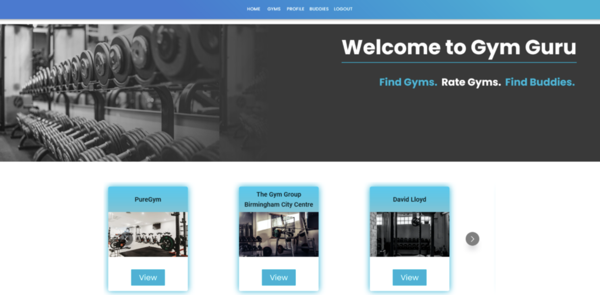
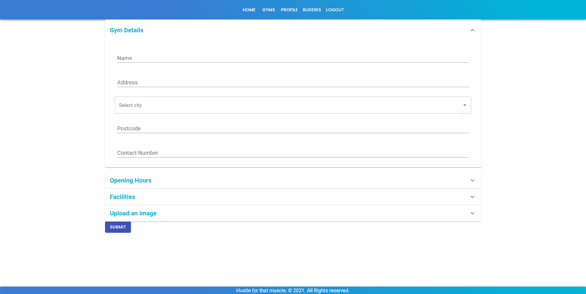
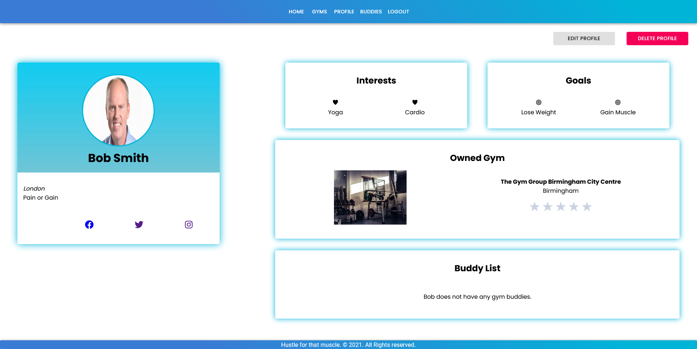

# Gym Guru

## Table of Contents

- [Gym Guru](#gym-guru)
  - [Table of Contents](#table-of-contents)
  - [Project Link](#project-link)
  - [Functionality](#functionality)
  - [What did we do?](#what-did-we-do)
  - [Technologies:](#technologies)
    - [Installation](#installation)
  - [Getting Started](#getting-started)
    - [Launch the app](#launch-the-app)
  - [License](#license)
  - [Screenshots](#screenshots)

## Project Link

Click [here](https://serene-ravine-79398.herokuapp.com/) to view the project on GitHub pages.

Gym Guru is the ultimate platform for gym owners and users. The inspiration behind our concept was based around discussions around how lockdown has affected us all and the social anxiety around easing back into normality. We soon realised that we all shared the same opinion of wanting to get back into a gym that's right for us, but would want to go with someone who also shares the same gym interests , to encourage consistency in going. We soon expanded on this idea as we realised independent gym owners have also been affected during this pandemic. To help support small businesses, we created a platform for users and owners to build a gym community!

After we agreed on all our features, the idea of Gym Guru was born!

## Functionality

Our application allows gym users to:

- Find gyms local to them
- Rate and review gym
- Filter gyms to suit individual fitness needs
- Find and interact with other gym users
- The buddies feature allows a user to: receive buddy requests, accept or decline them, then connect with a buddy via social media.

Our application allows gym owners to:

- Add their gym details, including the name, location, contact number, exercise and other facilities
- See other gyms in the area to understand more about their competitors

## What did we do?

- Created a full-stack app that allows gym users to sign up, login, review gyms and find buddies.
- Our application also allows gym owners to sign up, login, add and update their gym details and check out other local gyms.
- Used Material UI to create a sleek, consistent design for our components
- Used React to render components
- Used React Hook Form to process the data from user input
- Used MongoDB and Mongoose to store our user and gym data
- Used GraphQL to make queries and mutations for API requests
- Used Apollo Client with GraphQL to send the queries and mutations
- Used AWS S3 to allow users and gym owners to upload imagery which would save to their personal or gym profile

## Technologies:

- HTML
- CSS
- Material UI
- JavaScript
- React
- React Hook Form
- GraphQl
- MongoDb
- Mongoose
- Bcrypt
- Apollo server
- Node.js

### Installation

```
git clone https://github.com/PDUBB3/gym-guru-client.git
cd dish-up
npm i
```

## Getting Started

To seed the data:

```
npm run seed
```

### Launch the app

```
npm run start
```

## License

MIT

## Screenshots





